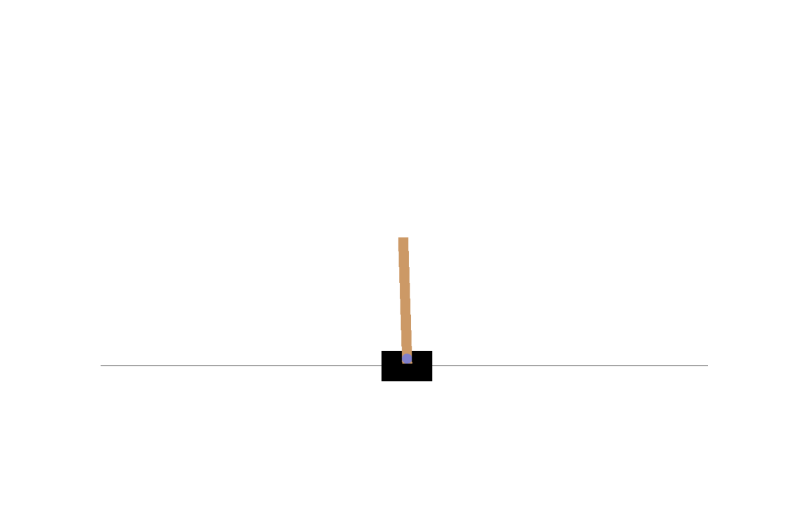
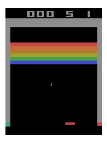
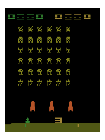

# torchRL

PyTorch Implementations of basic Reinforcement Learning algorithms.

* You can experiment various RL algorithms such as SARSA, DQN, DDQN, and etc.

* You can easily set up hyper-parameters for training by adjusting yaml-formatted config files.

* The code can be used with OpenAI gym environments.

* Tested on "CartPole-v1", "BreakoutDeterministic-v4" and "SpaceInvadersDeterministic-v4" settings.

<p align="left">
    
    
    
</p>

## Algorithms
1. SARSA
2. Vanilla Q-Learning
3. [DQN](https://arxiv.org/abs/1312.5602) (Playing Atari with Deep Reinforcement Learning)
4. [DDQN](https://arxiv.org/abs/1509.06461) (Deep Reinforcement Learning with Double Q-learning
)
5. [Dueling DQN](https://arxiv.org/abs/1511.06581) (Dueling Network Architectures for Deep Reinforcement Learning
)
6. Actor-Critic (TD)

## Dependencies
1. PyTorch (This package was tested on cpu version of PyTorch v1.9. But chances are you'll be fine with most of older versions of PyTorch!)
2. OpenAI GYM
3. yacs

## Usage
You can make your own training setup by creating a yaml file.

Most of hyper-parameters can be re-used by inheriting those from the base config [module](torchRL/configs/cartpole_defaults.py).

Check some examples in [configs](configs) folder.

To train, 
```bash
# For Classic Control problems (CartPole)
python train_classicControl.py {config file}

# For Atari games
python train_atari.py {config file}
```

To see how the trained network works, 
```bash
python demo_cartpole.py {config file} {weight file}
```

If you want to save the result as a gif file (for cartpole), use --save flag.
```bash
python demo_cartpole.py {config file} {weight file} --save
```